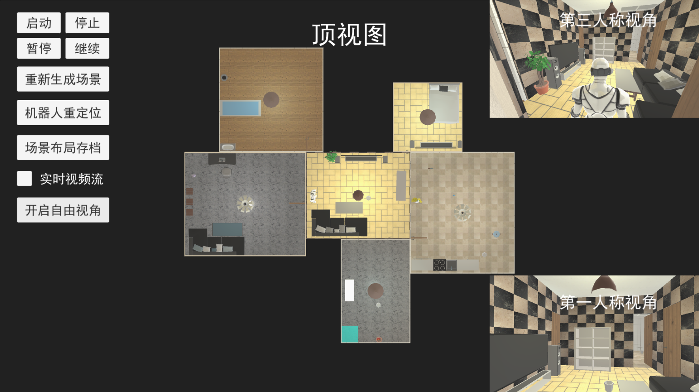
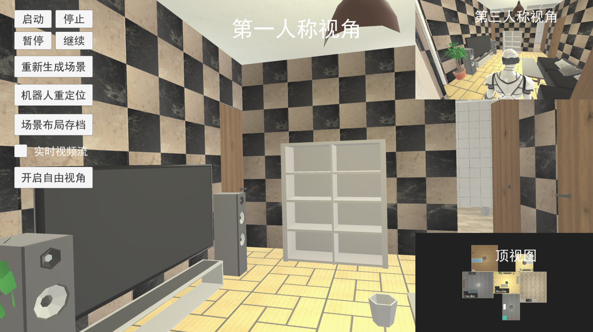
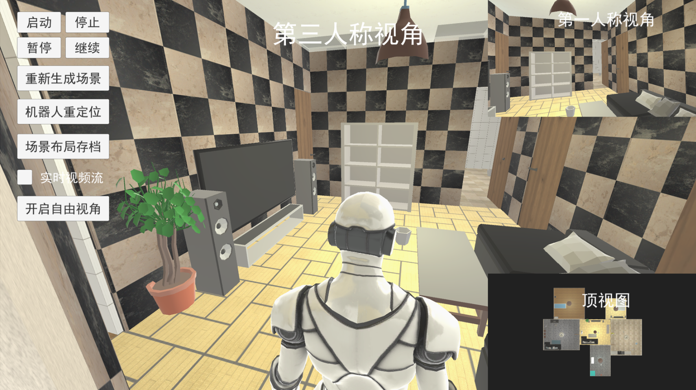
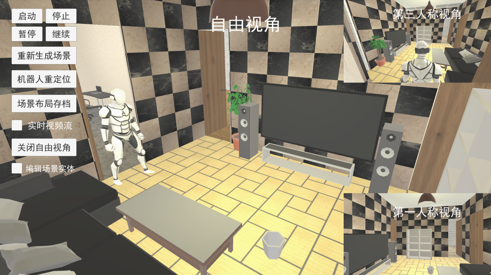
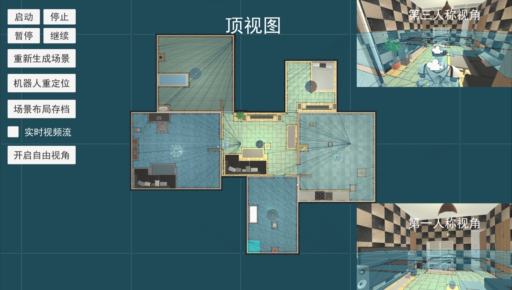
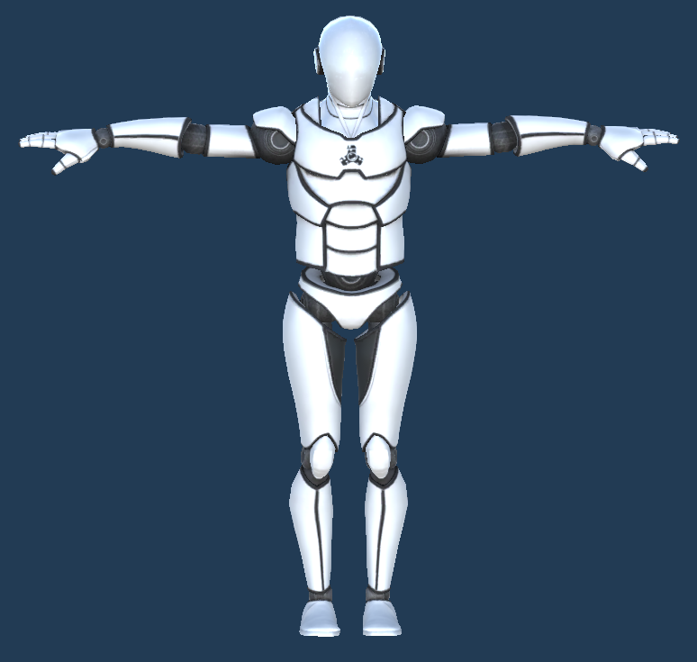
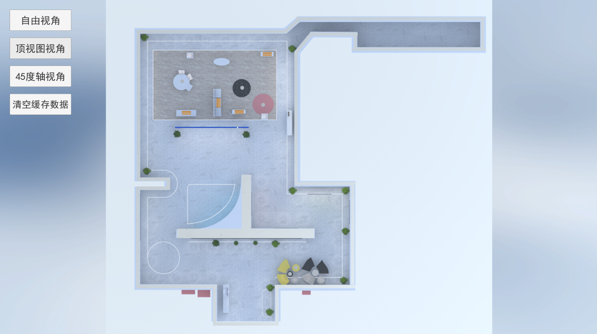
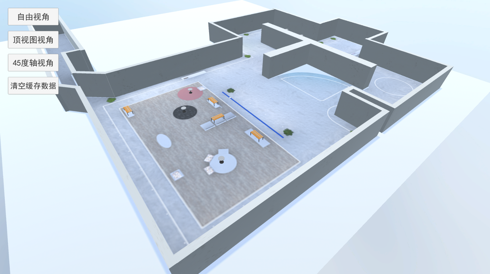

# 仿真程序手册


[TOC]

## 仿真程序地址

http://10.101.80.74:8083/


## 交互方式

鼠标：左键可点击平面UI按钮进行交互，自由视角中按下右键移动画面可旋转，按住中键(滚轮)画面可平移，滑动中键(滚轮)画面可缩放。

键盘：在自由视角中，使用W、S、A、D键画面可上下左右移动


## 核心配置文件

路径：../StreamingAssets/Config.txt

```json
{
    "CoreConfig": {
        "SceneID": "", 	//唯一标识当前仿真程序，为空则从Web前端获取此ID，不为空则使用当前ID
        "UseTestData":1,	//是否使用测试数据，0-不使用 1-使用
        "LocalReadFileName":"",	//本地读档的文件名称xxx.json，根据本地json文件来生成房间布局以及物体，为空则不从本地读档，从服务端获取相关数据，不为空则为本地读档，需填写文件名xxx.json(../StreamingAssets/xxx.json)，测试：SaveScene_test_20231110.json
        "SendEntityInfoHZ": 10.0	//发送视觉感知实体信息频率, n秒/次
        "ShowLog":1 //是否显示控制台日志 1-显示 0-不显示
    },
    "HttpConfig": {
        "IP": "10.11.81.241",
        "Port": "4006"
    },
    "MqttConfig": {
        "ClientIP": "10.5.24.27"
    },
    "VideoStreaming": {
        "Frame": 20, //帧数
        "Quality": 50 //画质【1，100】
    }
}
```


## 读档

两种读档方式用于生成房间布局以及物品

### 本地读档：

配置方式：

1.需要提供指定格式的json文件xxx.json，并放置在../StreamingAssets/xxx.json目录下

2.打开../StreamingAssets/Config.json文件，修改CoreConfig的LocalReadFileName的值为xxx.json

### 服务器读档

根据web前端跳转UnityWebgl时传来的CanReadFile参数来判定是否需要读档，CanReadFile=1时可从服务器读档，反之则为非读档，即随机生成场景

### 优先级

本地读档 >服务器读档>不读档(随机生成)


## 核心功能脚本

程序执行入口：GameLaunch.cs

资源异步加载：LoadAssetsByAddressable.cs

核心数据缓存：MainData.cs

程序主逻辑：GameLogic.cs

指令任务调度：TaskCenter.cs

Http、Mqtt接口管理：InterfaceDataCenter.cs

随机生成房间：GenerateRoomData.cs、GenerateRoomItemModel.cs、GenerateRoomBorderModel.cs

机器人AI寻路：AIRobotMove.cs


## AB包

资源路径：Assets/GameMain/AB/...

技术实现：Addressabe


## 程序运行流程

### 初始化场景

1. 读取Config.txt配置文件获取场景ID，Http、Mqtt接口IP，端口等重要信息用于初始化场景数据

2. 通过用Addressable异步加载ab资源

3. 通过配置文件信息，获取场景数据来源，优先级：测试版 > 本地读档 > 服务器读档 > 不读当(随机生成)

   测试版：即MainData.UseTestData=true，获取数据全程跳过接口，改为固定写死的数据

   本地读档：获取数据改为本地json文件中的事先写好的数据，具体用法，事先在StreamingAssets文件夹下存储好固定格式的json文件，再在../StreamingAssets/Config.txt中LocalReadFileName字段中填写前者json文件的文件名称(需要带后缀.json)

   服务器读档：从http接口中获取之前存档的json数据， 先进行预读档，通过http接口获取当前场景ID的所有数据信息并缓存，查询当前场景实例是否存在于web端列表中，若不存在则窗体弹出无法获取窗体信息，无法生成场景

   不读当(随机生成)：从http接口中获取基础数据，再由引擎中生成随机数，获取具体数据并缓存

4. 创建机器人根节点

5. 注册消息事件，场景生成完毕后回调，具体内容包括对未存档过的场景，自动存档一次，场景原点偏移，机器人实体的生成，初始化相机，初始化视频流，缓存所有实体物品数据信息，提交场景图物体与房间的邻接关系，提交场景图布局房间与房间位置关系，启动协程持续提交场景全局实体信息以及摄像机前的实体信息，初始化任务调度模块

6. 获取并缓存房间与房间邻接关系数据以及所有房间实体数据，若为服务器读档 调用http接口获取，缓存数据并返回

7. 接入Mqtt通信，其中PC端(win、Linux)通过WebGLSupport发起，Web端通过h5中js实现

8. 协程等待ab资源全部加载完毕，以及http接口数据缓存完毕后解析缓存的数据，生成对应的实体(墙壁、门、地板、天花板、其他物品)，生成场景主UI窗体

9. 等待所有实体生成完毕，发送场景生成完毕消息标识


### 运行时功能

1.“启动、停止、暂停、继续”，调用Http接口改变仿真引擎状态，simulator/changeSimulatorState

2.“重新生成场景”，整体房间布局不变，重新生成不同规格的房间，房间中的物品相对调整，调用api：GameLogic.GetInstance.GenerateScene()

3.“机器人重定位”，调用api：GameLogic.GetInstance.GenerateRobot()

4.“场景布局存档”，存储当前场景中必要的数据，调用api：DataSave.GetInstance.Save()，

存储接口地址：http://10.101.80.74:8080/simulation/history/add

存储数据结构：List<RoomInfo> 、List<RoomBaseInfo>、List<BorderEntityData>、PostThingGraph、GetEnvGraph_data、List<RoomMatData>

5.“实时视频流”，开启后通过Mqtt通信持续传输第一、三人称的相机视频流信息，渲染的质量和发送的频率可在配置文件../StreamingAssets/Config.txt中调整， 调用api：LiveStreaming.GetInstance.IsBeginLiveStreaming = ison


## 映射表

### 机器人动画映射表

| 动画描述 | 动画指令名称         |
| -------- | -------------------- |
| 行走     | Walk                 |
| 拿取     | Grab_item            |
| 放下     | Grab_item_pull       |
| 打开门   | Open_Door_Inside     |
| 关闭门   | Close_Door_Inside    |
| 擦桌子   | Robot_CleanTable     |
| 操作阀门 | Wheel                |
| 充电     | Pile                 |
| 蹲下拾取 | Pick_item            |
| 推       | Push_Start           |
| 拉       | Pull_Start           |
| 按下按钮 | Press_Button         |
| 空闲姿态 | Idle                 |
| 敲门     | Knock_on_door        |
| 跳跃     | Jump                 |
| 射箭     | CDA_Release          |
| 回旋踢   | Combat_Spinning_Kick |
| 双手抱胸 | Hand_Chest           |
| 双手叉腰 | Hand_Waist           |
| 查找     | Find                 |


### 房间映射表

| 房间名称 | 类型(唯一标识) |
| -------- | -------------- |
| 客厅     | LivingRoom     |
| 卧室     | BedRoom        |
| 浴室     | BathRoom       |
| 书房     | StudyRoom      |
| 厨房     | KitChenRoom    |
| 储藏室   | StorageRoom    |
| 办公室   | OfficeRoom     |
| 茶水间   | TeaRoom        |
| 大厅     | LobbyRoom      |
| 实验室   | LabRoom        |


### 物品映射表

| 物品名称 | 类型(唯一标识) | 静态属性 |
| -------- | -------------- | -------- |
| 浴池     | Bathtub        | true     |
| 床       | Bed            | true     |
| 厨房灶台 | Bigsink        | true     |
| 垃圾桶   | Bin            | false    |
| 书       | Book           | false    |
| 箱子     | Box            | true     |
| 柜子     | Cabinet        | true     |
| 椅子     | Chair          | true     |
| 衣架     | Clothes        | false    |
| 杯子     | Cup            | false    |
| 书桌     | Desk           | true     |
| 饮品     | Drink          | false    |
| 食物     | Food           | false    |
| 刀       | Knife          | false    |
| 台灯     | Lamp           | true     |
| 台式电脑 | PC             | true     |
| 充电桩   | Pile           | true     |
| 绿植     | Plant          | true     |
| 锅       | Pot            | false    |
| 洗手池   | Sink           | true     |
| 沙发     | Sofa           | true     |
| 电视     | TV             | true     |


## 接口

### Http接口

```c#
    private static string URL_SUBROOT = "http://10.11.81.241:4006/";
    //获取场景图，物体与房间的邻接关系
    private static string URL_GET_THING_GRAPH = URL_SUBROOT + "simulator/getThingGraph";
    //提交场景图，物体与房间的邻接关系
    private static string URL_POST_THING_GRAPH = URL_SUBROOT + "simulator/postThingGraph";
    //获取环境场景图,房间与房间的邻接关系
    private static string URL_GET_ENV_GRAPH = URL_SUBROOT + "simulator/getEnvGraph";
    //改变仿真引擎状态
    private static string URL_CHANGE_SIMULATOR_STATE = URL_SUBROOT + "simulator/changeSimulatorState";
    //改变仿真引擎状态
    private static string URL_GENERATE_TMPID = URL_SUBROOT + "simulator/generateTmpId";
    //Web端房间数据列表
    public const string URL_SCENE_QUERYLIST = "http://10.101.80.74:8080/simulation/scene/queryList";
```


### Mqtt接口

```c#
    //更新全局场景图
    private const string TOPIC_GLOBAL = "/simulator/thingGraph/global";
    //更新相机视⻆场景图
    private const string TOPIC_CAMERA = "/simulator/thingGraph/camera";
    //接收服务器控制指令
    public const string TOPIC_SEND = "simulator/send";
    //发控制结果给服务器
    public const string TOPIC_RECV = "simulator/recv";
    //发送房间信息
    public const string TOPIC_ROOMINFODATA = "simulator/roomInfoData";
    //引擎状态
    public const string TOPIC_CHANGESTATE = "simulator/changeState";
    //直播流信息
    public static string TOPIC_LIVEDATA = "simulator/liveStreaming_" + MainData.SceneID;
    //新增房间实体模型
    public const string TOPIC_ADD_GOODS = "simulator/addGoods";
    //删除房间实体模型
    public const string TOPIC_DEL_GOODS = "simulator/delGoods";
    //测试从Web端 接收服务器控制指令
    public const string TOPIC_WEB_SEND = "simulator/web/send";
    //测试 发控制结果给Web端
    public const string TOPIC_WEB_RECV = "simulator/web/recv";
    //给web端更新全局场景图
    public const string TOPIC_Web_GLOBAL = "/simulator/thingGraph/web/global";
    //web端的房间布局变更
    public const string TOPIC_WEB_CHANGEPOSITION = "simulator/changePosition";
    //web端自定义相机坐标
    public const string TOPIC_WEB_CHANGEVIEWPOSITON = "simulator/changeViewPositon";
```


## 重要接口json示例

### 新增物品

```json
{
    "tmpId": "TMP:Simulator:1703640645117-1703661471970",
    "idScene": "Simulator:1703640645117",
    "entityInfo": [
        {
            "id": "sim:1112",
            "type": "AAA",
            "modelId": "AAA_1",
            "pos": {
                "x": 7,
                "y": 6
            },
            "scale" :{
                "x": 2,
                "y": 1,
                "z": 2
            },
            "dynamic": 0,
            "roomInfo": {
                "roomType": "LivingRoom",
                "roomID": "sim:1"
            },
            "putArea": "In", //该属性当且仅当实体有父对象 即parentEntityInfo属性不为空时才有意义
            "parentEntityInfo": {}
        }
    ]
}
```


```json
{
    "tmpId": "TMP:Simulator:1703120770813-1703128011536",
    "idScene": "Simulator:1703120770813",
    "entityInfo": [
        {
            "id": "sim:1008",
            "type": "Chair",
            "modelId": "Chair_1",
            "pos": {//当前仅当无父对象即parentEntityInfo为空时有意义
                "x": 3.3,
                "y": 2.5
            },
             "scale" :{
                "x": 2,
                "y": 1,
                "z": 2
            },
            "dynamic": 0,
            "roomInfo": {
                "roomType": "LivingRoom",
                "roomID": "sim:1"
            },
            "putArea": "Below",
            "parentEntityInfo": {
                "id": "sim:1008",
                "type": "Desk"
            }
        }
    ]
}
```

### 删除物品

删除Book_sim:1008物品以及被依赖的所有物品

```json
{
    "tmpId": "TMP:Simulator:1703120770813-1703128299541",
    "idScene": "Simulator:1703120770813",
    "entityInfo": [
        {
            "id": "sim:1008",
            "type": "Book",
            "delChind": 1
        }
    ]
}
```

仅删除Desk_sim:1007物品，所以依赖的物品的父对象由当前物品变为当前房间

```json
{
    "tmpId": "TMP:Simulator:1703120770813-1703128694016",
    "idScene": "Simulator:1703120770813",
    "entityInfo": [
        {
            "id": "sim:1007",
            "type": "Desk",
            "delChind": 0
        }
    ]
}
```

### 任务指令

topic：simulator/send

拿取书

```json
{
    "motionId": "motion://Grab_item",
    "name": "Grab_item",
    "objectId": "sim:1001",
    "objectName": "Book",
    "position": [
        2.0,
        0.0,
        3.5
    ],
    "rotation": [
        0.0,
        0.0,
        0.0
    ],
    "sceneID": "Simulator:1702954572478",
    "taskId": "task:grab1703215659222",
    "tmpId": "TMP:Simulator:1702954572478-1703215654114"
}
```

推箱子

```json
{
    "motionId": "motion://Grab_item",
    "name": "Push_Start",
    "objectId": "sim:1009",
    "objectName": "Box",
    "position": [
        2.0,
        0.0,
        3.5
    ],
    "rotation": [
        0.0,
        0.0,
        0.0
    ],
    "sceneID": "Simulator:1703225037387",
    "taskId": "task:grab1703215659222",
    "tmpId": "TMP:Simulator:1703225037387-1703237969422"
}
```


## 附件截图

### 顶视图



### 第一人称



### 第三人称



### 自由视角



### AI导航




### 机器人




# 数字孪生程序手册

## Mqtt接口

### IP

10.5.24.27

### 访客坐标信息

feature/people_perception

### 机器人坐标信息

feature/robot_pos

## 机器人数据结构

```
{
    "robotId": "test",
    "timestamp": "111",
    "data": {
        "feature": {
            "orientation": [
                1.0,
                0.0,
                0.0
            ],
            "position": [
                1.0,
                0.0,
                0.0
            ]
        }
    },
    "clientId": "test01"
}
```


## 访客数据结构

```json
{
    "robotId": "x_biped_upper_part_0",
    "timestamp": 1702437482,
    "data": {
        "feature": [
            {
                "gender": 0,
                "bbox": [],
                "visitor_id": -1,
                "person_point": {
                    "left_judge": -1,
                    "right_judge": -1,
                    "left_dir": [
                        0,
                        0,
                        0
                    ],
                    "right_dir": [
                        0,
                        0,
                        0
                    ],
                    "left_pos": [
                        0,
                        0,
                        0
                    ],
                    "right_pos": [
                        0,
                        0,
                        0
                    ]
                },
                "face_box": [],
                "location_world": [
                    0,
                    0,
                    0
                ],
                "loss_reason": 1,
                "detect_id": -1,
                "face_pose": [
                    0,
                    0,
                    0
                ],
                "person_2d_keypoint": [],
                "angle": 30.0,
                "speak": -1,
                "mask": -1,
                "glass": -1,
                "body_pose": [
                    0,
                    0,
                    0
                ],
                "person_3d_keypoint": [],
                "velocity": [
                    0,
                    0,
                    0
                ],
                "person_action": {
                    "hand_shake": null,
                    "take_a_photo": null,
                    "point_to_an_object": null,
                    "read": null,
                    "talk_to_a_person": null,
                    "touch_an_object": null,
                    "grab_a_person": null,
                    "hand_wave": null,
                    "text_on_look_at_a_cellphone": null,
                    "watch_TV": null,
                    "watch_a_person": null,
                    "drink": null,
                    "unknown": null,
                    "hug_a_person": null,
                    "hand_clap": null,
                    "turn_a_screwdriver": null,
                    "listen_to_a_person": null,
                    "answer_phone": null,
                    "stand": null,
                    "walk": null,
                    "sit": null
                },
                "camera_location": [
                    0,
                    0,
                    0
                ],
                "mouth": -1,
                "gaze": {
                    "conf": null,
                    "location": null,
                    "target": null
                },
                "track_id": 1,
                "move_dir_x": "unknown",
                "location_confidence": 1,
                "loss_track_time": 0,
                "move_dir_y": "unknown",
                "location": [
                    0.4911286132130158,
                    1.8817616074412558,
                    0
                ],
                "time": {
                    "nsecs": 160089600,
                    "secs": 1702437482
                },
                "face_pose_world": [
                    0,
                    0,
                    0
                ],
                "intention_info": {
                    "body_left_refer": -1,
                    "engagement_with_location": null,
                    "engagement": null,
                    "body_right_refer": -1,
                    "head_refer": -1
                },
                "age": -1,
                "status": 2
            },
            {
                "gender": 0,
                "bbox": [],
                "visitor_id": -1,
                "person_point": {
                    "left_judge": -1,
                    "right_judge": -1,
                    "left_dir": [
                        0,
                        0,
                        0
                    ],
                    "right_dir": [
                        0,
                        0,
                        0
                    ],
                    "left_pos": [
                        0,
                        0,
                        0
                    ],
                    "right_pos": [
                        0,
                        0,
                        0
                    ]
                },
                "face_box": [],
                "location_world": [
                    0,
                    0,
                    0
                ],
                "loss_reason": 1,
                "detect_id": -1,
                "face_pose": [
                    0,
                    0,
                    0
                ],
                "person_2d_keypoint": [],
                "angle": 90.0,
                "speak": -1,
                "mask": -1,
                "glass": -1,
                "body_pose": [
                    0,
                    0,
                    0
                ],
                "person_3d_keypoint": [],
                "velocity": [
                    0,
                    0,
                    0
                ],
                "person_action": {
                    "hand_shake": null,
                    "take_a_photo": null,
                    "point_to_an_object": null,
                    "read": null,
                    "talk_to_a_person": null,
                    "touch_an_object": null,
                    "grab_a_person": null,
                    "hand_wave": null,
                    "text_on_look_at_a_cellphone": null,
                    "watch_TV": null,
                    "watch_a_person": null,
                    "drink": null,
                    "unknown": null,
                    "hug_a_person": null,
                    "hand_clap": null,
                    "turn_a_screwdriver": null,
                    "listen_to_a_person": null,
                    "answer_phone": null,
                    "stand": null,
                    "walk": null,
                    "sit": null
                },
                "camera_location": [
                    0,
                    0,
                    0
                ],
                "mouth": -1,
                "gaze": {
                    "conf": null,
                    "location": null,
                    "target": null
                },
                "track_id": 2,
                "move_dir_x": "unknown",
                "location_confidence": 1,
                "loss_track_time": 0,
                "move_dir_y": "unknown",
                "location": [
                    0.5339549631637497,
                    1.928978804075479,
                    0
                ],
                "time": {
                    "nsecs": 160089600,
                    "secs": 1702437482
                },
                "face_pose_world": [
                    0,
                    0,
                    0
                ],
                "intention_info": {
                    "body_left_refer": -1,
                    "engagement_with_location": null,
                    "engagement": null,
                    "body_right_refer": -1,
                    "head_refer": -1
                },
                "age": -1,
                "status": 2
            },
            {
                "gender": 0,
                "bbox": [],
                "visitor_id": -1,
                "person_point": {
                    "left_judge": -1,
                    "right_judge": -1,
                    "left_dir": [
                        0,
                        0,
                        0
                    ],
                    "right_dir": [
                        0,
                        0,
                        0
                    ],
                    "left_pos": [
                        0,
                        0,
                        0
                    ],
                    "right_pos": [
                        0,
                        0,
                        0
                    ]
                },
                "face_box": [],
                "location_world": [
                    0,
                    0,
                    0
                ],
                "loss_reason": 1,
                "detect_id": -1,
                "face_pose": [
                    0,
                    0,
                    0
                ],
                "person_2d_keypoint": [],
                "angle": -150.0,
                "speak": -1,
                "mask": -1,
                "glass": -1,
                "body_pose": [
                    0,
                    0,
                    0
                ],
                "person_3d_keypoint": [],
                "velocity": [
                    0,
                    0,
                    0
                ],
                "person_action": {
                    "hand_shake": null,
                    "take_a_photo": null,
                    "point_to_an_object": null,
                    "read": null,
                    "talk_to_a_person": null,
                    "touch_an_object": null,
                    "grab_a_person": null,
                    "hand_wave": null,
                    "text_on_look_at_a_cellphone": null,
                    "watch_TV": null,
                    "watch_a_person": null,
                    "drink": null,
                    "unknown": null,
                    "hug_a_person": null,
                    "hand_clap": null,
                    "turn_a_screwdriver": null,
                    "listen_to_a_person": null,
                    "answer_phone": null,
                    "stand": null,
                    "walk": null,
                    "sit": null
                },
                "camera_location": [
                    0,
                    0,
                    0
                ],
                "mouth": -1,
                "gaze": {
                    "conf": null,
                    "location": null,
                    "target": null
                },
                "track_id": 3,
                "move_dir_x": "unknown",
                "location_confidence": 1,
                "loss_track_time": 0,
                "move_dir_y": "unknown",
                "location": [
                    0.5805256439172308,
                    1.8731614227999107,
                    0
                ],
                "time": {
                    "nsecs": 160089600,
                    "secs": 1702437482
                },
                "face_pose_world": [
                    0,
                    0,
                    0
                ],
                "intention_info": {
                    "body_left_refer": -1,
                    "engagement_with_location": null,
                    "engagement": null,
                    "body_right_refer": -1,
                    "head_refer": -1
                },
                "age": -1,
                "status": 2
            }
        ],
        "featureId": "people_perception"
    },
    "clientId": null
}
```


## 附件截图

### 主界面





### 机器人


